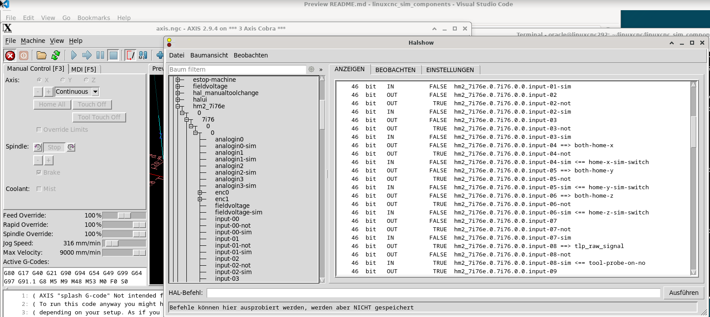

# 🧪 Components for Simulating Hardware in LinuxCNC

In some situations, it’s useful to simulate hardware rather than testing directly on a real machine. This repository provides components and configuration examples to create a realistic simulation environment in **LinuxCNC**, using your existing `.ini` and `.hal` files.

The goal is to reuse your actual machine configuration and detect hardware availability at runtime. If hardware is not detected, the system loads a simulation.

This is especially useful for:
- Testing configurations without physical hardware
- Running LinuxCNC on a virtual machine
- Developing or debugging HAL logic
- Teaching or learning LinuxCNC without access to physical machines

The mock of the 7i76e currently supports the configuration of the card with parameters:  
e.g. "num_encoders=1 num_pwmgens=1 num_stepgens=3 sserial_port_0=20xxxx".  

---

## 🧰 Hardware Simulated

This project currently includes simulation support for:
- Mesa 7i76e card
- Touch probe
- Laser fork light barrier
- Simple virtual objects (ring and quad workpieces)
- Limit and home switches
- Emergency stop
- Spindle ready signal

---

## 🧠 Idea and Workflow

- Use the same `.ini` and `.hal` files for both real and simulated machines.
- At startup, a Tcl script checks whether the hardware is reachable (via `ping`).
- If not reachable, a mocked version of the hardware is loaded.
- Additional simulation components can then be included based on this logic.

---

## 🔧 Example `.ini` Configuration

```ini
[HOSTMOT2]
DRIVER=hm2_eth 
IPADDR="192.168.1.121"
BOARD=7i76e
CONFIG="num_encoders=1 num_pwmgens=1 num_stepgens=3 sserial_port_0=20xxxx"

[HAL]
HALUI = halui
TWOPASS = on,verbose
HALFILE = AxisJoints/motion.hal
HALFILE = Mesacard/hm2_eth.tcl

HALFILE = AxisJoints/x_axis.hal
...
HALFILE = Mesacard/hm2_eth_post.hal
...
```

---

## 🔄 Detecting Real vs. Mocked Hardware

`Mesacard/hm2_eth.tcl` checks the Mesa board’s IP. If `ping` fails, it loads a mock component instead:

```tcl
set board_ip_ping [string trim [lindex $::HOSTMOT2(IPADDR) 0] """]

if {![info exists ::mesa_card_type]} {
    set retries 3
    set ::mesa_card_type "mock"
    for {set i 0} {$i < $retries} {incr i} {
        set ping_result [catch {exec ping -c 1 -W 1 $board_ip_ping}]
        if {$ping_result == 0} {
            set ::mesa_card_type "real"
            break
        }
        after 300
    }
}

if {$::mesa_card_type eq "real"} {
    loadrt hostmot2
    loadrt hm2_eth board_ip=[lindex $::HOSTMOT2(IPADDR) 0] config=[lindex $::HOSTMOT2(CONFIG) 0]
} else {
    loadrt hm2_eth_mock board=[lindex $::HOSTMOT2(BOARD) 0] config=[lindex $::HOSTMOT2(CONFIG) 0]
}


```

Post-load tasks (done in `hm2_eth_post.hal`):

```hal
addf hm2_7i76e.0.read  servo-thread
addf hm2_7i76e.0.write servo-thread

setp hm2_7i76e.0.watchdog.timeout_ns       5000000
setp hm2_7i76e.0.dpll.01.timer-us          -50
setp hm2_7i76e.0.stepgen.timer-number      1
```

> **Note**: The `write` function must be added at the end of the HAL load sequence to avoid launch errors. This is the main reason  
for the hm2_eth_post.hal.

---

## 🧩 Simulated Wiring and Components

HAL files like `x_axis.hal` are used for simulation and real world.  
At the end of each hal file, a `.tcl` is sourced, :

```hal
net both-home-x => joint.0.home-sw-in
net both-home-x => joint.0.neg-lim-sw-in
net both-home-x => joint.0.pos-lim-sw-in

source AxisJoints/x_axis_sim.tcl
```

And this file contains the additions needed for simulation
Example simulation logic from `x_axis_sim.tcl`:

```tcl
if {$::mesa_card_type eq "mock"} {
    loadrt comp names=comp_x
    addf comp_x servo-thread

    net Xhomeswpos => comp_x.in0
    sets Xhomeswpos $::JOINT_0(HOME_OFFSET)
    net x-pos-cmd  => comp_x.in1

    setp comp_x.hyst .02
    net home-x-sim-switch hm2_7i76e.0.7i76.0.0.input-04-sim <= comp_x.out
}
```

### Simulated Pin Mapping

Pins like `input-xx` are typically `OUT` pins. The mock module adds `input-xx-sim` pins as `IN`, allowing simulation inputs:

```bash
halcmd show pin hm2_7i76e.*
```

```
hm2_7i76e.0.7i76.0.0.input-04       => OUT
hm2_7i76e.0.7i76.0.0.input-04-sim   <= IN (simulation input)
```

---

## 🛠️ Building the Components

1. **Install Dev Dependencies**

```bash
sudo apt install linuxcnc-dev
```

2. **Clone the Repository**

```bash
cd ~/linuxcnc
git clone https://github.com/pkl42/linuxcnc_components_sim.git components_sim
```

3. **Update Your `.bashrc`**

```bash
if [ -d ~/linuxcnc/components_sim ]; then
	export PATH="$PATH:~/linuxcnc/components_sim"
fi
```

4. **Compile**

```bash
cd ~/linuxcnc/components_sim
sudo halcompile --install hm2_eth_mock.c

# Optional additional components
sudo halcompile --install sim_fork_light_barrier.comp
sudo halcompile --install sim_workpiece_quad.comp
sudo halcompile --install sim_workpiece_ring.comp
```

or just run
~~~bash
sh compile.sh
~~~
---

## 🧪 Testing the Mock Driver

```bash
halrun
loadrt threads name1=servo-thread period1=1000000
loadrt hm2_eth_mock board=7i76e config="num_encoders=1 num_pwmgens=1 num_stepgens=3 sserial_port_0=20xxxx"
addf hm2_7i76e.0.read  servo-thread
addf hm2_7i76e.0.write servo-thread
start
show pin hm2_7i76e.0.*
```

---

## 📦 Simulating Other Devices

As your wiring might look different (different input pins for the signals) you might  
adapt these examples to your machine.

### Limit & Home Switches

Each axis has its own simulation Tcl script. Here's an example for the X-axis:

```tcl
if {$::mesa_card_type eq "mock"} {
    loadrt comp names=comp_x
    addf comp_x servo-thread
    net Xhomeswpos => comp_x.in0
    sets Xhomeswpos $::JOINT_0(HOME_OFFSET)
    net x-pos-cmd  => comp_x.in1
    setp comp_x.hyst .02
    net home-x-sim-switch hm2_7i76e.0.7i76.0.0.input-04-sim <= comp_x.out
}
```

### Emergency Stop

```tcl
if {$::mesa_card_type eq "mock"} {
    setp hm2_7i76e.0.7i76.0.0.fieldvoltage-sim 23.8
    setp hm2_7i76e.0.7i76.0.0.input-13-sim 1
}
```

### Spindle Acknowledge Signal

As the mock driver do not care about spindle acceleration, therefor once the spinena signal is send,  
the spindle on speed will be acknoledged.

```tcl
if {$::mesa_card_type eq "mock"} {
    loadrt not names=spindle-ena-inv
    addf spindle-ena-inv servo-thread

    net spindle-enable spindle-ena-inv.in <= hm2_7i76e.0.7i76.0.0.spinena
    net spindle-ena-inv-out spindle-ena-inv.out => hm2_7i76e.0.7i76.0.0.input-14-sim
}
```

### Touch Probe

With the and-probe-signal-sim component up to two virtual objects, which triggers the touch probe can be added.

```tcl
if {$::mesa_card_type eq "mock"} {
    loadrt and2 names=and-probe-signal-sim
    addf and-probe-signal-sim servo-thread

    setp and-probe-signal-sim.in0 1
    setp and-probe-signal-sim.in1 1

    net touch-probe_signal-sim and-probe-signal-sim.out => hm2_7i76e.0.7i76.0.0.input-09-sim

    source TouchProbe/RingBlock_sim.tcl
}
```

---

## 🧱 Ring Block Simulation

`RingBlock_sim.tcl` sets up a virtual ring-shaped object:

```tcl
loadrt sim_workpiece_ring names=sim-wp-ring
addf sim-wp-ring servo-thread

net x-pos-cmd => sim-wp-ring.cur-pos-x
net y-pos-cmd => sim-wp-ring.cur-pos-y
net z-pos-cmd => sim-wp-ring.cur-pos-z
net tool_offset_z motion.tooloffset.z => sim-wp-ring.tool-offset-z
net sim-tool-diameter halui.tool.diameter => sim-wp-ring.tool-diameter
net sim-wp-ring-touched sim-wp-ring.cmd_pos_inside_inv => and-probe-signal-sim.in0

setp sim-wp-ring.wp-x-pos 0.0
setp sim-wp-ring.wp-y-pos 0.0
setp sim-wp-ring.wp-z-pos -195.188
setp sim-wp-ring.wp-radius-inside 20.0
setp sim-wp-ring.wp-radius-outside 40.0
setp sim-wp-ring.wp-z-height 10.0
```

Overall all virtual objects will follow the same pattern. You can define the geometry, like  
- wp-radius-inside 
- wp-radius-outside
- wp-z-height

and the "virtual" machine coordinate where this component is placed  
- wp-x-pos
- wp-y-pos
- wp-z-pos

and the current tool parameters:
- tool-offset-z
- tool-diameter

the origin of the ring is in the center and lower z-level.

The current machine position is sourced into the component    
- cur-pos-x
- cur-pos-y
- cur-pos-z

and the output pins 
- cmd_pos_inside
- cmd_pos_inside_inv

detects whether the given machine position is within the objects or not.

---

## 💡 Final Notes

- This simulation is designed to **mimic real hardware**, not replace full machine automation.
- Manual steps like GUI confirmation during tool changes are still required.
- You’re free to adapt or extend the mock components to fit your specific hardware configuration.

---

## 📸 Pin Mapping Example



---

## ✅ License

Open-source under [GPL License](LICENSE) — Feel free to adapt and extend!